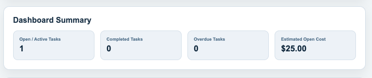
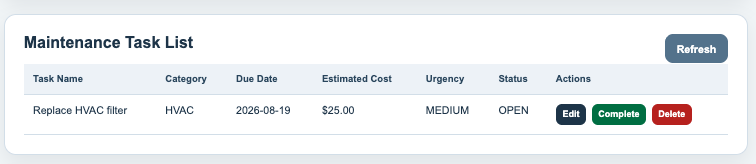
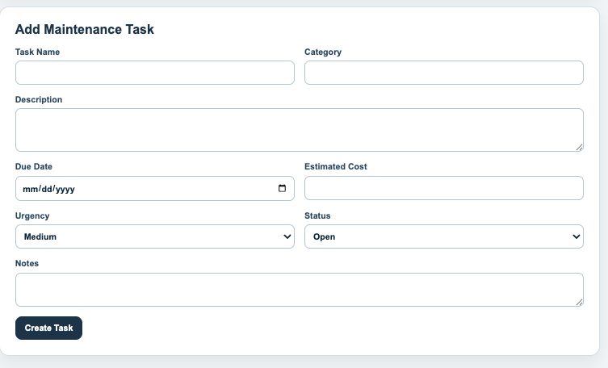
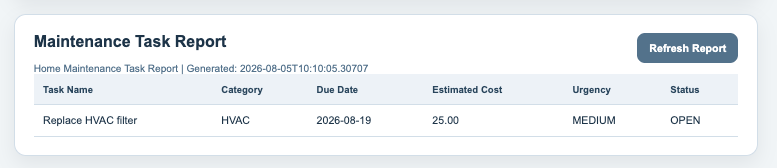

# HomeCare Tracker

HomeCare Tracker is a full-stack web application for managing home maintenance tasks, estimated repair costs, urgency levels, due dates, and maintenance reports.

The project was originally developed as a software engineering capstone and is now being improved as a public portfolio project to demonstrate full-stack development, cloud deployment, authentication, database design, Docker, and future AI-assisted planning features.

## Live Demo

Deployed application:

http://victor-task4-home-maintenance.duckdns.org

Backend health check:

http://victor-task4-home-maintenance.duckdns.org/api/health

## Screenshots

### Dashboard



### Task List



### Add Task Form



### Maintenance Report



### Mobile View


## Current Features

- Create, view, update, complete, and delete maintenance tasks
- Track task name, category, description, due date, estimated cost, urgency, status, and notes
- Search tasks by keyword
- Filter tasks by category, status, and urgency
- Sort tasks by due date, estimated cost, urgency, or task name
- Dashboard summary for open, completed, overdue, and estimated open-cost totals
- Maintenance report with title, generated timestamp, columns, and task rows
- REST API built with Java Spring Boot
- React frontend built with Vite
- PostgreSQL database in Docker deployment
- Docker Compose full-stack deployment
- AWS Lightsail cloud deployment
- Nginx reverse proxy for same-domain frontend and backend access

## Tech Stack

### Frontend

- React
- Vite
- JavaScript
- CSS
- Nginx

### Backend

- Java
- Spring Boot
- Spring Web
- Spring Data JPA
- Spring Security configuration
- JUnit
- MockMvc

### Database

- PostgreSQL for Docker/cloud deployment
- H2 for local development/testing

### DevOps and Deployment

- Docker
- Docker Compose
- AWS Lightsail
- GitHub
- GitLab archive
- Nginx reverse proxy

## Architecture Overview

The deployed version uses AWS Lightsail with Docker Compose.

User browser  
→ Nginx frontend container on port 80  
→ `/api` requests proxied internally to Spring Boot backend  
→ Backend connects to PostgreSQL through Docker networking  

The evaluator-facing and recruiter-facing app URL does not require a raw IP address or a separate `:8080` backend URL.

## Project Structure

```text
backend/
  Spring Boot REST API, service layer, model, repository, tests

frontend/
  React/Vite frontend and Nginx configuration

deployment/
  Deployment planning files and deployment scripts

docs/
  Project documentation, diagrams, testing notes, roadmap, and evidence

docker-compose.yml
  Full-stack container orchestration
