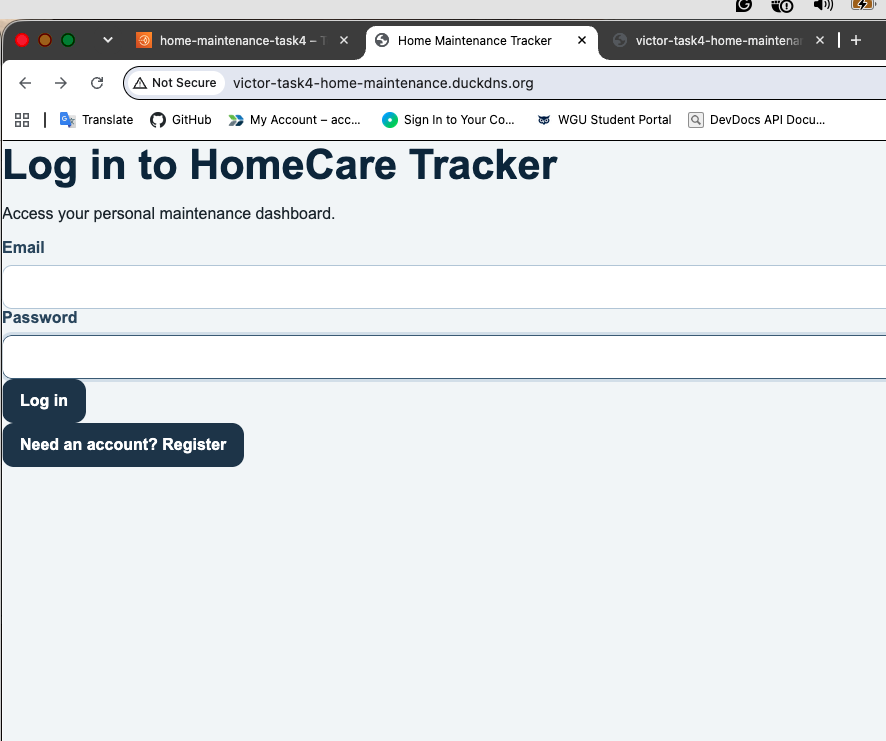
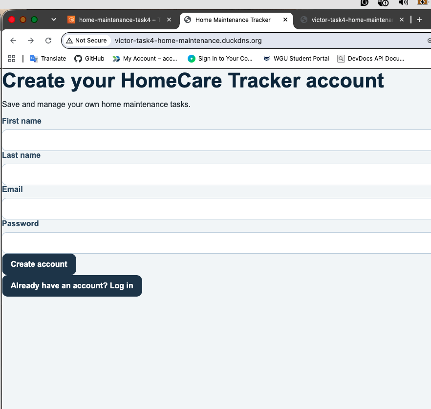
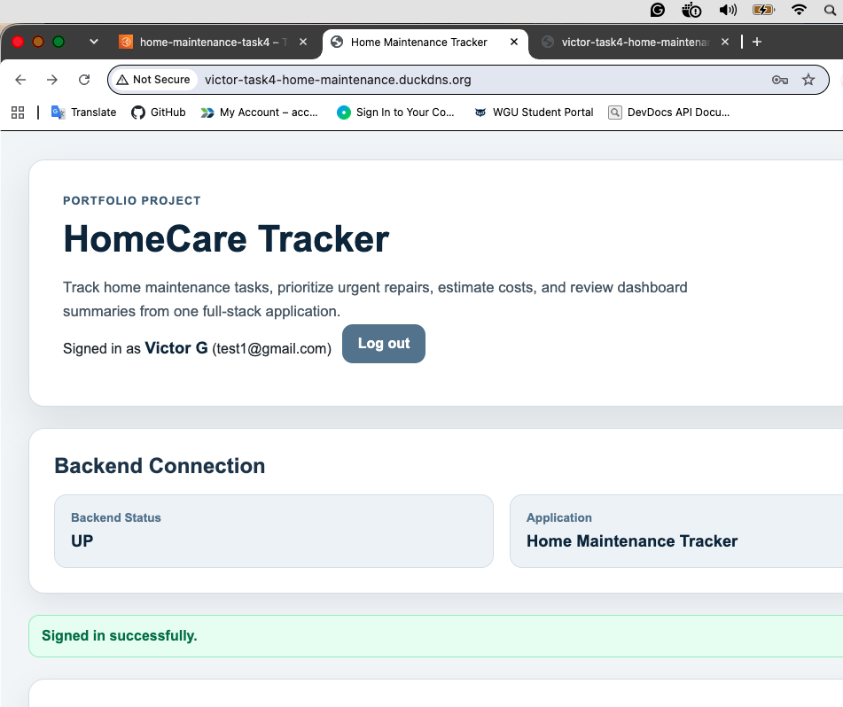
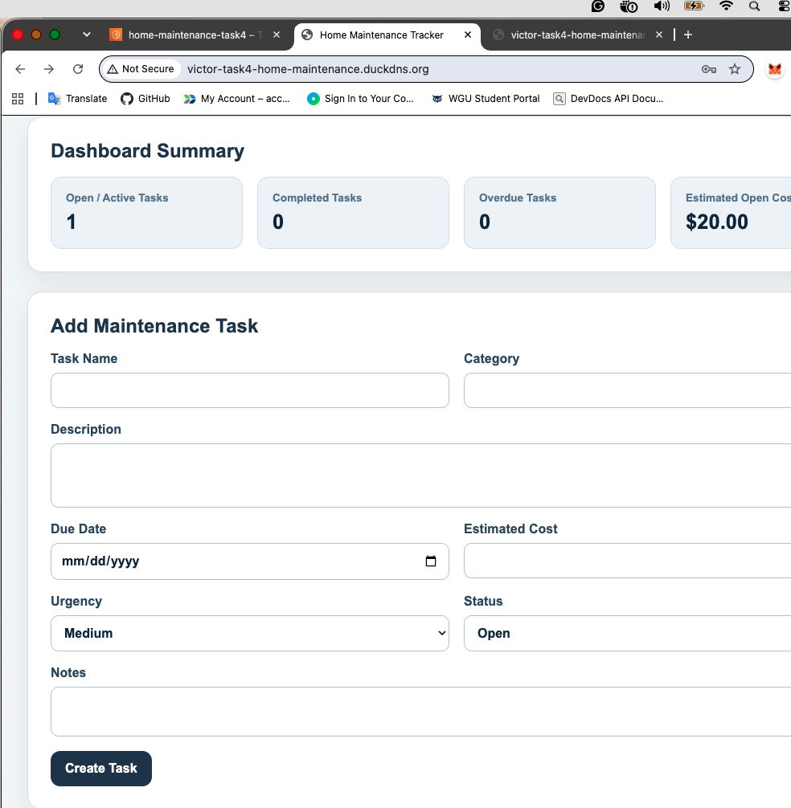
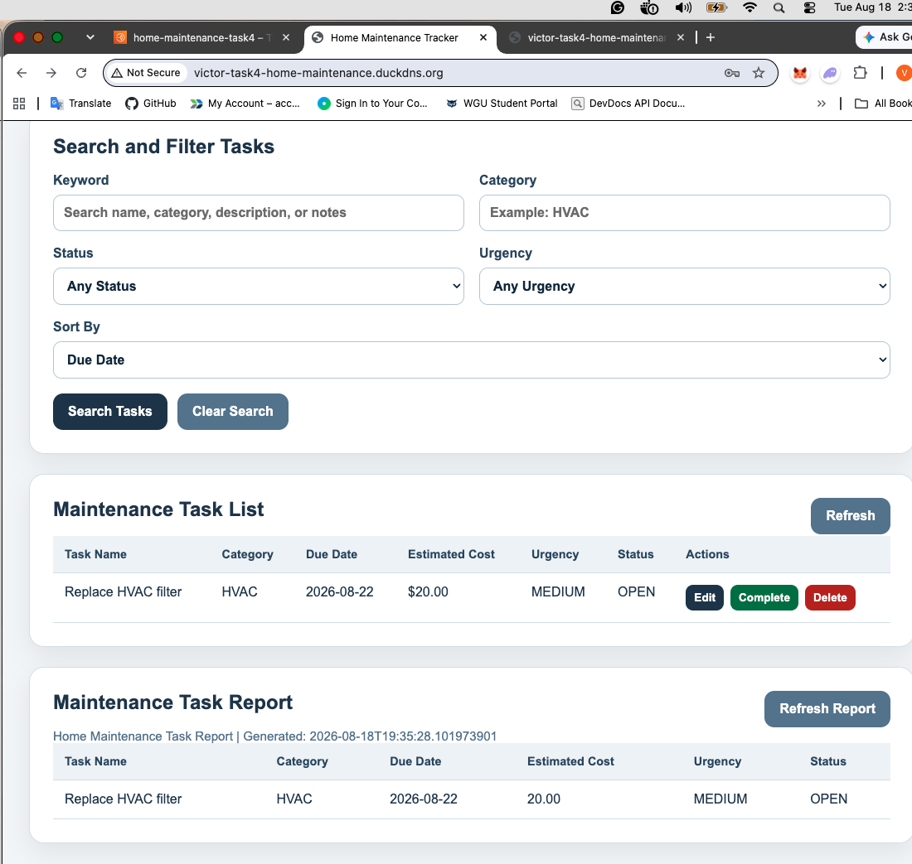

# HomeCare Tracker

HomeCare Tracker is a full-stack web application for managing home maintenance tasks, estimated repair costs, urgency levels, due dates, maintenance reports, and user-specific task data.

The project was originally developed as a software engineering capstone and is now being improved as a public portfolio project to demonstrate full-stack development, secure authentication, REST API design, database relationships, Docker, cloud deployment, and long-term product improvement.

## Live Demo

Deployed application:

http://victor-task4-home-maintenance.duckdns.org

Backend health check:

http://victor-task4-home-maintenance.duckdns.org/api/health

> Note: The deployed version may be updated as portfolio improvements are completed and redeployed.

## Screenshots

## Screenshots

### Login Page



### Register Page



### Authenticated Dashboard



### User-Specific Task List



### Maintenance Report




## Current Features

- User registration
- User login and logout
- JWT-based authentication
- BCrypt password hashing
- Protected task endpoints
- User-specific task ownership
- Create, view, update, complete, and delete maintenance tasks
- Track task name, category, description, due date, estimated cost, urgency, status, and notes
- Search tasks by keyword
- Filter tasks by category, status, and urgency
- Sort tasks by due date, estimated cost, urgency, task name, category, or status
- Dashboard summary for open, completed, overdue, and estimated open-cost totals
- Maintenance report with title, generated timestamp, columns, and task rows
- REST API built with Java Spring Boot
- React frontend built with Vite
- PostgreSQL database in Docker/cloud deployment
- H2 database for local testing
- Docker Compose full-stack deployment
- AWS Lightsail cloud deployment
- Nginx reverse proxy for same-domain frontend and backend access

## Authentication and Security

HomeCare Tracker now includes a full authentication foundation.

Users can register and log in with an email and password. Passwords are hashed with BCrypt before being stored. After successful registration or login, the backend returns a JWT token. The frontend stores the token locally and sends it with authenticated API requests using the `Authorization` header.

```text
Authorization: Bearer <jwt-token>

```

Task endpoints are protected. A user can only access maintenance tasks that belong to their own account.

Security-related features include:

- Password hashing with BCrypt
- JWT token generation
- JWT request authentication filter
- Stateless Spring Security configuration
- Protected `/api/tasks` endpoints
- Public `/api/auth/register` and `/api/auth/login` endpoints
- User-specific task ownership
- Backend tests for authenticated task isolation
- Cross-user task access prevention

## Tech Stack

### Frontend

- React
- Vite
- JavaScript
- CSS
- Local storage for auth token and current user session
- Authenticated API client

### Backend

- Java
- Spring Boot
- Spring Web
- Spring Data JPA
- Spring Security
- JWT authentication
- BCrypt password hashing
- JUnit
- MockMvc

### Database

- PostgreSQL for Docker/cloud deployment
- H2 for local development and testing
- JPA entity relationships

### DevOps and Deployment

- Docker
- Docker Compose
- AWS Lightsail
- GitHub
- GitLab archive
- Nginx reverse proxy
- DuckDNS domain

## Architecture Overview

The deployed version uses AWS Lightsail with Docker Compose.

```text
User browser
  ↓
React frontend served through Nginx
  ↓
Authenticated API requests with JWT
  ↓
Spring Boot REST API
  ↓
Spring Security JWT filter
  ↓
Service layer enforces user-specific task access
  ↓
PostgreSQL database
```

The deployed app uses same-domain routing:

```text
Frontend:
http://victor-task4-home-maintenance.duckdns.org

Backend API:
http://victor-task4-home-maintenance.duckdns.org/api
```

The frontend does not require users to call a raw backend IP address or a separate `:8080` backend URL.

## Backend API Overview

### Public Endpoints

```text
GET  /api/health
POST /api/auth/register
POST /api/auth/login
```

### Protected Task Endpoints

These endpoints require a valid JWT token:

```text
GET    /api/tasks
POST   /api/tasks
GET    /api/tasks/{id}
PUT    /api/tasks/{id}
PATCH  /api/tasks/{id}/complete
DELETE /api/tasks/{id}
GET    /api/tasks/search
GET    /api/tasks/dashboard
GET    /api/tasks/report
```

## Data Model Overview

### AppUser

```text
AppUser
- id
- firstName
- lastName
- email
- passwordHash
- role
- createdDate
- updatedDate
```

### MaintenanceTask

```text
MaintenanceTask
- id
- taskName
- category
- description
- dueDate
- estimatedCost
- urgencyLevel
- status
- notes
- createdDate
- updatedDate
- owner
```

Relationship:

```text
AppUser 1 ---- many MaintenanceTask
```

Each maintenance task belongs to one user.

## Project Structure

```text
backend/
  Spring Boot REST API, security, service layer, model, repository, tests

frontend/
  React/Vite frontend, auth pages, API services, and Nginx configuration

deployment/
  Deployment planning files and deployment scripts

docs/
  Project documentation, diagrams, testing notes, roadmap, screenshots, and archived capstone materials

docker-compose.yml
  Full-stack container orchestration
```

## Local Development

### Backend

From the project root:

```bash
cd backend
./mvnw spring-boot:run
```

Backend local URL:

```text
http://localhost:8080
```

Health check:

```text
http://localhost:8080/api/health
```

### Frontend

From the project root:

```bash
cd frontend
npm install
npm run dev
```

Frontend local URL:

```text
http://localhost:5173
```

## Local Full-Stack Test Flow

1. Start the backend.
2. Start the frontend.
3. Open the frontend in the browser.
4. Register a new user.
5. Create a maintenance task.
6. Log out.
7. Register or log in as a second user.
8. Confirm the second user cannot see the first user’s task.
9. Create a task as the second user.
10. Log back in as the first user.
11. Confirm the first user still only sees their own task.

## Docker Deployment

From the project root:

```bash
docker compose up --build
```

The Docker deployment starts:

- PostgreSQL database
- Spring Boot backend
- React/Nginx frontend

## Testing

Run backend tests:

```bash
cd backend
./mvnw clean test
```

Run frontend production build:

```bash
cd frontend
npm run build
```

## Portfolio Improvement Roadmap

Completed improvements:

- Public GitHub cleanup
- Recruiter-facing README
- Project summary
- Portfolio roadmap
- Screenshots
- WGU-specific documentation archive
- User registration
- User login/logout
- BCrypt password hashing
- JWT token generation
- JWT authentication filter
- Protected task endpoints
- User-specific task ownership
- Backend ownership tests
- Frontend authentication foundation

Planned improvements:

- Improved UI/UX and responsive design
- More polished landing page
- Recurring maintenance tasks
- AI-assisted maintenance task suggestions
- Cost and urgency recommendation helper
- Charts and analytics dashboard
- File/photo attachments for receipts and repair images
- Email or in-app reminders
- GitHub Actions CI workflow
- HTTPS and custom domain deployment

See:

```text
docs/PORTFOLIO_ROADMAP.md
```

## Why This Project Matters

Home maintenance is easy to ignore until repairs become urgent or expensive. This application helps homeowners organize maintenance tasks, track estimated costs, prioritize urgent work, and view maintenance data in one place.

From an engineering perspective, this project demonstrates full-stack application development, REST API design, secure authentication, database persistence, user-specific authorization, Dockerized deployment, cloud hosting, testing, and iterative product improvement.

## Portfolio Value

This project demonstrates practical software engineering skills that are relevant to junior software engineering, cloud software engineering, and full-stack development roles:

- Building a full-stack application from frontend to backend
- Designing REST APIs
- Implementing authentication and authorization
- Securing passwords with hashing
- Using JWTs for stateless authentication
- Enforcing user-specific data access
- Modeling database relationships with JPA
- Writing automated backend tests
- Running a React frontend with an authenticated API client
- Deploying with Docker Compose
- Hosting on AWS Lightsail
- Improving an academic project into a production-style portfolio project