# Class Diagram

## Project

Home Maintenance Tracker and Cost Prioritization Application

## Purpose

This class diagram shows the main backend classes used in the Home Maintenance Tracker application. It highlights the entity, DTOs, repository, service, controller, report classes, and exception handling structure.

The diagram also shows object-oriented programming evidence, including encapsulation, inheritance, abstraction, and polymorphism.

## Mermaid Class Diagram

```mermaid
classDiagram

    class MaintenanceTask {
        -Long id
        -String taskName
        -String category
        -String description
        -LocalDate dueDate
        -BigDecimal estimatedCost
        -UrgencyLevel urgencyLevel
        -TaskStatus status
        -String notes
        -LocalDateTime createdDate
        -LocalDateTime updatedDate
        #MaintenanceTask()
        +MaintenanceTask(...)
        +getId() Long
        +getTaskName() String
        +setTaskName(String) void
        +getCategory() String
        +setCategory(String) void
        +getDescription() String
        +setDescription(String) void
        +getDueDate() LocalDate
        +setDueDate(LocalDate) void
        +getEstimatedCost() BigDecimal
        +setEstimatedCost(BigDecimal) void
        +getUrgencyLevel() UrgencyLevel
        +setUrgencyLevel(UrgencyLevel) void
        +getStatus() TaskStatus
        +setStatus(TaskStatus) void
        +getNotes() String
        +setNotes(String) void
        +getCreatedDate() LocalDateTime
        +getUpdatedDate() LocalDateTime
    }

    class UrgencyLevel {
        <<enumeration>>
        LOW
        MEDIUM
        HIGH
    }

    class TaskStatus {
        <<enumeration>>
        OPEN
        IN_PROGRESS
        COMPLETED
    }

    class MaintenanceTaskRequest {
        -String taskName
        -String category
        -String description
        -LocalDate dueDate
        -BigDecimal estimatedCost
        -UrgencyLevel urgencyLevel
        -TaskStatus status
        -String notes
        +getTaskName() String
        +setTaskName(String) void
        +getCategory() String
        +setCategory(String) void
        +getDescription() String
        +setDescription(String) void
        +getDueDate() LocalDate
        +setDueDate(LocalDate) void
        +getEstimatedCost() BigDecimal
        +setEstimatedCost(BigDecimal) void
        +getUrgencyLevel() UrgencyLevel
        +setUrgencyLevel(UrgencyLevel) void
        +getStatus() TaskStatus
        +setStatus(TaskStatus) void
        +getNotes() String
        +setNotes(String) void
    }

    class MaintenanceTaskResponse {
        -Long id
        -String taskName
        -String category
        -String description
        -LocalDate dueDate
        -BigDecimal estimatedCost
        -UrgencyLevel urgencyLevel
        -TaskStatus status
        -String notes
        -LocalDateTime createdDate
        -LocalDateTime updatedDate
        +MaintenanceTaskResponse(MaintenanceTask)
        +getId() Long
        +getTaskName() String
        +getCategory() String
        +getDescription() String
        +getDueDate() LocalDate
        +getEstimatedCost() BigDecimal
        +getUrgencyLevel() UrgencyLevel
        +getStatus() TaskStatus
        +getNotes() String
        +getCreatedDate() LocalDateTime
        +getUpdatedDate() LocalDateTime
    }

    class DashboardSummaryResponse {
        -long openTasks
        -long completedTasks
        -long overdueTasks
        -BigDecimal totalEstimatedOpenCost
        +DashboardSummaryResponse(...)
        +getOpenTasks() long
        +getCompletedTasks() long
        +getOverdueTasks() long
        +getTotalEstimatedOpenCost() BigDecimal
    }

    class MaintenanceReportResponse {
        -String title
        -LocalDateTime generatedAt
        -List~String~ columns
        -List~Map~ rows
        +MaintenanceReportResponse(MaintenanceReport)
        +getTitle() String
        +getGeneratedAt() LocalDateTime
        +getColumns() List~String~
        +getRows() List~Map~
    }

    class MaintenanceTaskRepository {
        <<interface>>
        +findByStatus(TaskStatus) List~MaintenanceTask~
        +findByUrgencyLevel(UrgencyLevel) List~MaintenanceTask~
        +findByCategoryIgnoreCase(String) List~MaintenanceTask~
        +findAll() List~MaintenanceTask~
        +findAll(Specification, Sort) List~MaintenanceTask~
        +save(MaintenanceTask) MaintenanceTask
        +delete(MaintenanceTask) void
        +findById(Long) Optional~MaintenanceTask~
    }

    class MaintenanceTaskService {
        -MaintenanceTaskRepository taskRepository
        +getAllTasks() List~MaintenanceTaskResponse~
        +searchTasks(...) List~MaintenanceTaskResponse~
        +getDashboardSummary() DashboardSummaryResponse
        +getMaintenanceTaskReport() MaintenanceReportResponse
        +getTaskById(Long) MaintenanceTaskResponse
        +createTask(MaintenanceTaskRequest) MaintenanceTaskResponse
        +updateTask(Long, MaintenanceTaskRequest) MaintenanceTaskResponse
        +markTaskCompleted(Long) MaintenanceTaskResponse
        +deleteTask(Long) void
        -findTaskOrThrow(Long) MaintenanceTask
        -buildSort(String) Sort
    }

    class MaintenanceTaskController {
        -MaintenanceTaskService taskService
        +getAllTasks() List~MaintenanceTaskResponse~
        +searchTasks(...) List~MaintenanceTaskResponse~
        +getDashboardSummary() DashboardSummaryResponse
        +getMaintenanceTaskReport() MaintenanceReportResponse
        +getTaskById(Long) MaintenanceTaskResponse
        +createTask(MaintenanceTaskRequest) MaintenanceTaskResponse
        +updateTask(Long, MaintenanceTaskRequest) MaintenanceTaskResponse
        +markTaskCompleted(Long) MaintenanceTaskResponse
        +deleteTask(Long) void
    }

    class MaintenanceTaskSpecification {
        +keywordContains(String) Specification~MaintenanceTask~
        +categoryEquals(String) Specification~MaintenanceTask~
        +statusEquals(TaskStatus) Specification~MaintenanceTask~
        +urgencyEquals(UrgencyLevel) Specification~MaintenanceTask~
    }

    class MaintenanceReport {
        <<abstract>>
        -String title
        -LocalDateTime generatedAt
        #MaintenanceReport(String)
        +getTitle() String
        +getGeneratedAt() LocalDateTime
        +getColumns()* List~String~
        +getRows()* List~Map~
    }

    class MaintenanceTaskReport {
        -List~MaintenanceTask~ tasks
        +MaintenanceTaskReport(List~MaintenanceTask~)
        +getColumns() List~String~
        +getRows() List~Map~
    }

    class ResourceNotFoundException {
        +ResourceNotFoundException(String)
    }

    class ApiErrorResponse {
        -int statusCode
        -String error
        -String message
        -String path
        -LocalDateTime timestamp
        -Map~String,String~ validationErrors
        +ApiErrorResponse(...)
        +getStatusCode() int
        +getError() String
        +getMessage() String
        +getPath() String
        +getTimestamp() LocalDateTime
        +getValidationErrors() Map~String,String~
    }

    class GlobalExceptionHandler {
        +handleResourceNotFound(ResourceNotFoundException, HttpServletRequest) ResponseEntity~ApiErrorResponse~
        +handleValidationErrors(MethodArgumentNotValidException, HttpServletRequest) ResponseEntity~ApiErrorResponse~
        +handleGeneralException(Exception, HttpServletRequest) ResponseEntity~ApiErrorResponse~
    }

    MaintenanceTask --> UrgencyLevel
    MaintenanceTask --> TaskStatus

    MaintenanceTaskRequest --> UrgencyLevel
    MaintenanceTaskRequest --> TaskStatus

    MaintenanceTaskResponse --> MaintenanceTask
    MaintenanceReportResponse --> MaintenanceReport

    MaintenanceTaskRepository --> MaintenanceTask

    MaintenanceTaskService --> MaintenanceTaskRepository
    MaintenanceTaskService --> MaintenanceTaskRequest
    MaintenanceTaskService --> MaintenanceTaskResponse
    MaintenanceTaskService --> DashboardSummaryResponse
    MaintenanceTaskService --> MaintenanceReportResponse
    MaintenanceTaskService --> MaintenanceReport
    MaintenanceTaskService --> MaintenanceTaskReport
    MaintenanceTaskService --> ResourceNotFoundException

    MaintenanceTaskController --> MaintenanceTaskService
    MaintenanceTaskController --> MaintenanceTaskRequest
    MaintenanceTaskController --> MaintenanceTaskResponse
    MaintenanceTaskController --> DashboardSummaryResponse
    MaintenanceTaskController --> MaintenanceReportResponse

    MaintenanceTaskSpecification --> MaintenanceTask

    MaintenanceTaskReport --|> MaintenanceReport
    MaintenanceTaskReport --> MaintenanceTask

    GlobalExceptionHandler --> ResourceNotFoundException
    GlobalExceptionHandler --> ApiErrorResponse
```



## OOP Evidence Explained

### Encapsulation

Encapsulation is shown through private fields and public getter/setter methods in classes such as:

- `MaintenanceTask`
- `MaintenanceTaskRequest`
- `MaintenanceTaskResponse`
- `DashboardSummaryResponse`
- `MaintenanceReportResponse`

### Inheritance

Inheritance is shown here:

```java
public class MaintenanceTaskReport extends MaintenanceReport
```

`MaintenanceTaskReport` inherits common report fields and behavior from `MaintenanceReport`.

### Abstraction

Abstraction is shown through the abstract parent class:

```java
public abstract class MaintenanceReport
```

The abstract class defines shared report structure and requires child classes to implement:

```java
getColumns()
getRows()
```

### Polymorphism

Polymorphism is shown in the service layer:

```java
MaintenanceReport report = new MaintenanceTaskReport(tasks);
```

The parent type `MaintenanceReport` holds a child object `MaintenanceTaskReport`.