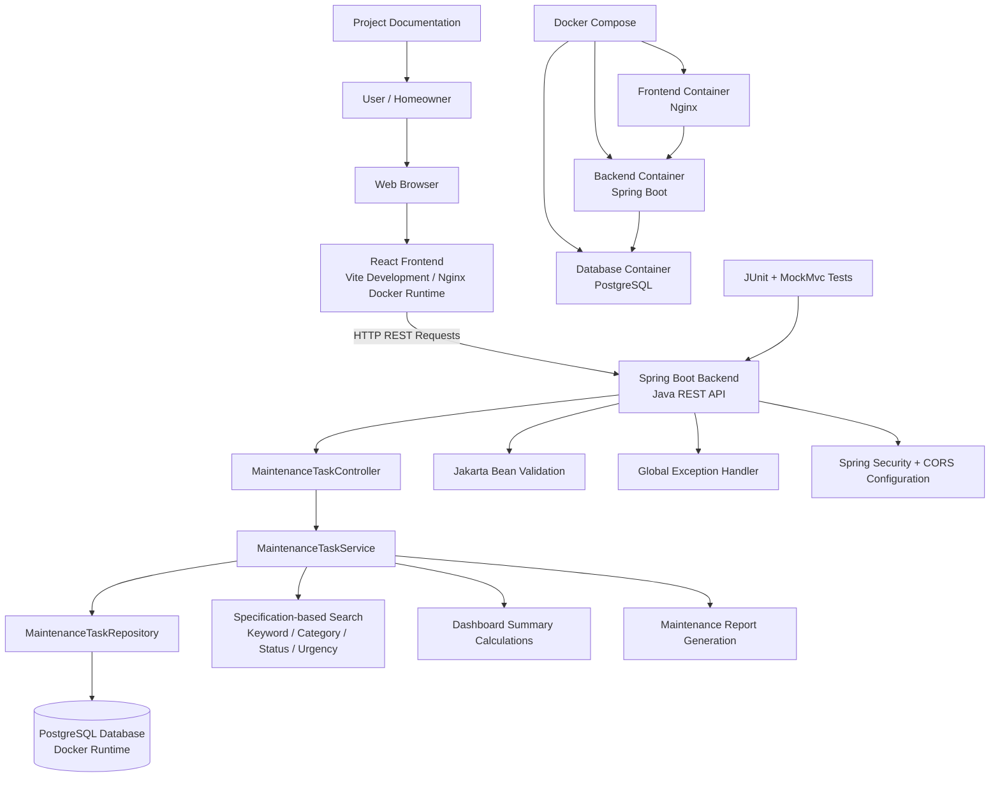
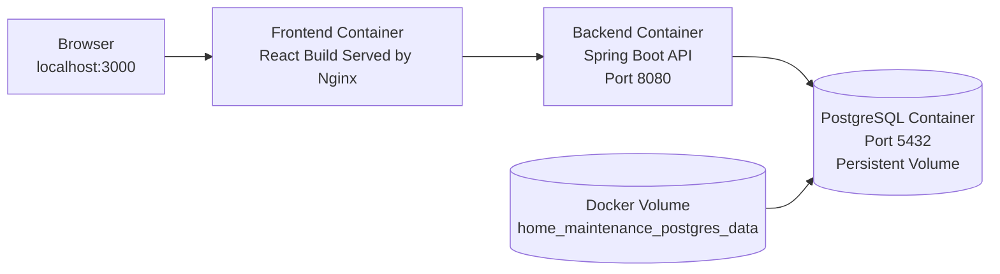
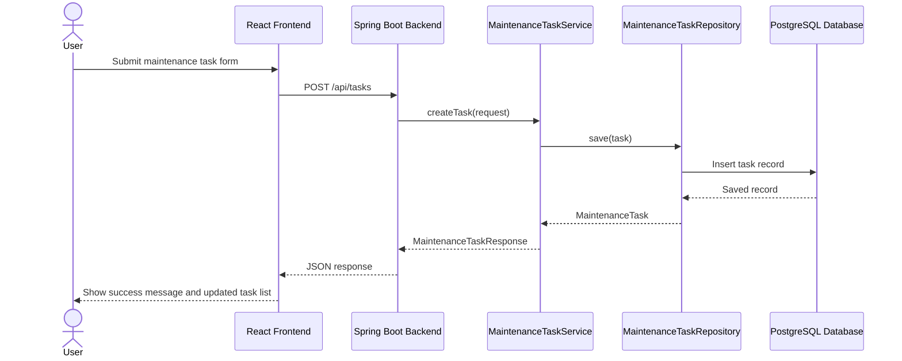

# System Design Diagram

## Project

Home Maintenance Tracker and Cost Prioritization Application

## Purpose

This design diagram shows the full-stack architecture of the application. It includes the React frontend, Spring Boot backend, REST API, PostgreSQL database, Docker Compose runtime, and documentation/testing artifacts.

## High-Level Architecture

## Docker Runtime Architecture

## Request Flow

## Backend Layer Responsibilities

| Layer | Responsibility |
|---|---|
| Controller | Receives REST API requests and returns responses |
| Service | Contains business logic for CRUD, search, dashboard, and reports |
| Repository | Handles database access through Spring Data JPA |
| Entity | Represents database task records |
| DTOs | Shape request and response data |
| Specification | Builds dynamic search/filter criteria |
| Report Classes | Generate structured report output |
| Exception Handler | Provides consistent error responses |
| Security Config | Controls CORS and basic API security settings |

## Frontend Responsibilities

The React frontend provides a user interface for:

- Viewing backend connection status
- Creating tasks
- Viewing task list
- Editing tasks
- Marking tasks complete
- Deleting tasks
- Searching and filtering tasks
- Viewing dashboard metrics
- Viewing maintenance task report

## Database Responsibilities

The PostgreSQL database stores maintenance task records, including:

- Task name
- Category
- Description
- Due date
- Estimated cost
- Urgency
- Status
- Notes
- Created date
- Updated date

## Deployment Design

The application is designed as three separate Docker services:

| Service | Container Purpose |
|---|---|
| frontend | Serves the compiled React application through Nginx |
| backend | Runs the Java Spring Boot REST API |
| postgres | Stores task records in PostgreSQL |

## Security and Configuration Design

The application uses:

- Server-side validation
- Centralized error handling
- Configurable CORS allowlist
- Environment variable support for database credentials
- Separate frontend/backend/database containers
- H2 for local development
- PostgreSQL for Docker runtime

## Scalability Notes

The application separates responsibilities into independent layers and services. The frontend, backend, and database can be maintained, tested, and deployed separately. The backend uses service and repository layers to keep business logic separate from API routing and database access.